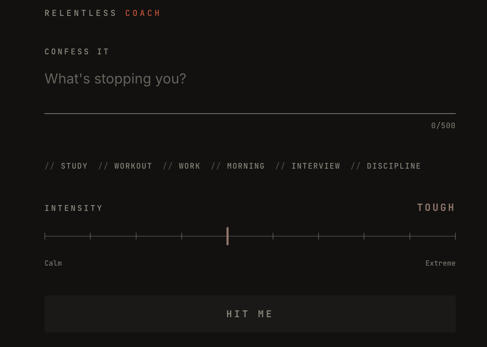
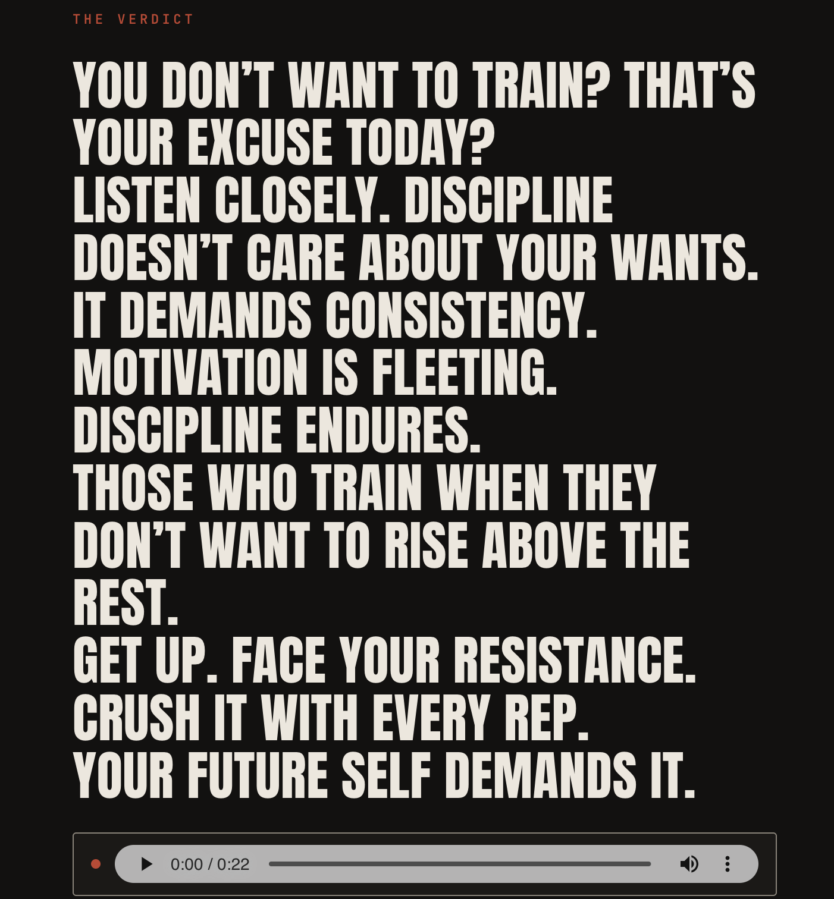
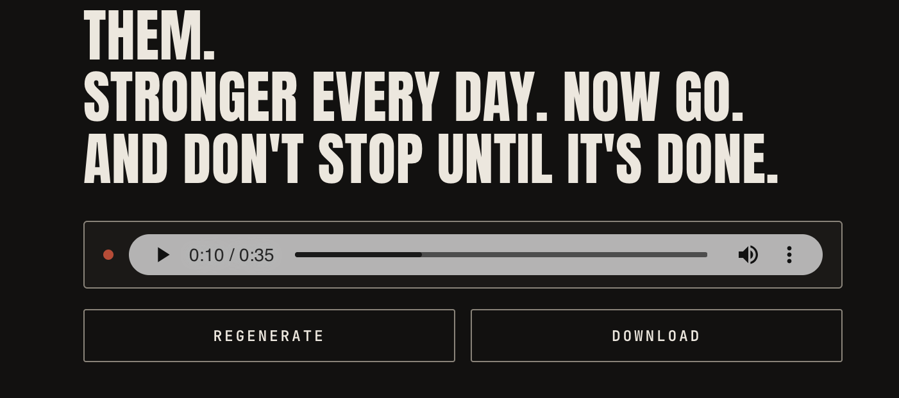

# Relentless Coach

An AI motivational voice-over generator. Describe what's stopping you, pick how hard you want to
get hit, and get back a short, intense, spoken pep talk from an original "relentless coach"
persona — written by an LLM and voiced by TTS.

> Turn excuses into action.

## How it works

```
Describe your excuse
        ↓
Pick a preset (optional) + intensity
        ↓
Generate
        ↓
LLM writes a script + voice direction
        ↓
TTS renders the voice-over
        ↓
Listen, regenerate, or download
```

## The experience

**1. Confess it.** Type what's stopping you, or tap a preset (`Study`, `Workout`, `Work`,
`Morning`, `Interview`, `Discipline`). Drag the intensity slider from `Calm` to `Extreme`.



**2. Get the verdict.** The coach turns your excuse into a short, direct script — no fluff,
short sentences, high conviction — synced to an audio player as it plays.



**3. Listen and act.** Play, pause, seek, adjust volume. Not intense enough? Hit regenerate for
a fresh take, or download the audio to keep.



## Tech stack

- **[Next.js](https://nextjs.org)** — web app and API routes
- **OpenAI** — generates the coaching script and voice direction from the user's situation and intensity
- **ElevenLabs** — turns the script into the coach's voice-over
- **Vitest** + Testing Library — unit/component tests
- **Docker** — containerized for deployment (see `Dockerfile` / `docker-compose.yml`)

## Environment variables

Create a `.env.local` with:

- `OPENAI_API_KEY` — OpenAI key used to generate the coaching script.
- `ELEVENLABS_API_KEY` — ElevenLabs key used to generate the voice-over audio.
- `ELEVENLABS_VOICE_ID` — ID of the fixed ElevenLabs voice used for playback.

## Running locally

```bash
npm install
npm run dev
```

Open [http://localhost:3000](http://localhost:3000).

## Running with Docker

```bash
docker compose up --build
```

Reads the same `.env.local` and serves the production build on
[http://localhost:3000](http://localhost:3000).

## Testing & building

```bash
npm test
npm run build
```
